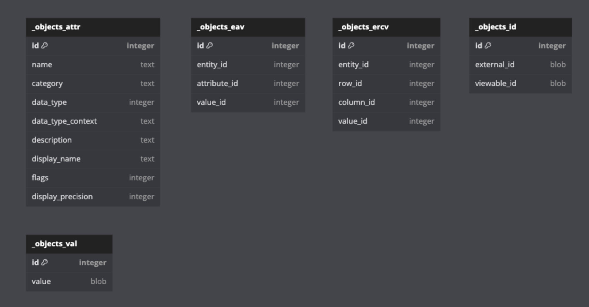
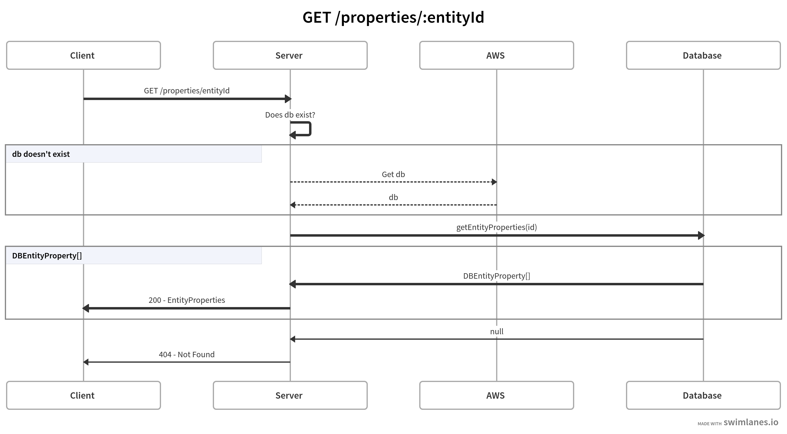

# Setup
Clone the repository and run the following commands:
```bash
$ cd <project_folder>
$ npm install
```
Copy the `.env.example` file to `.env` and fill in the required values. Then run the following command to start the application:
```bash
$ npm start
```

# Database Tables
See the image below for the database tables:


# API Documentation
See the image below for the API documentation for the properties endpoints:


## To do
- Dockerize the application
- Swagger documentation
- authentication
- validation
- testing
- Document how to deploy
- Aggregate property data for the requested entity id and all it's parents
- cache results
- format output based on it's data type and precision
- how do you handle requests for large DB files that take a long time to download?